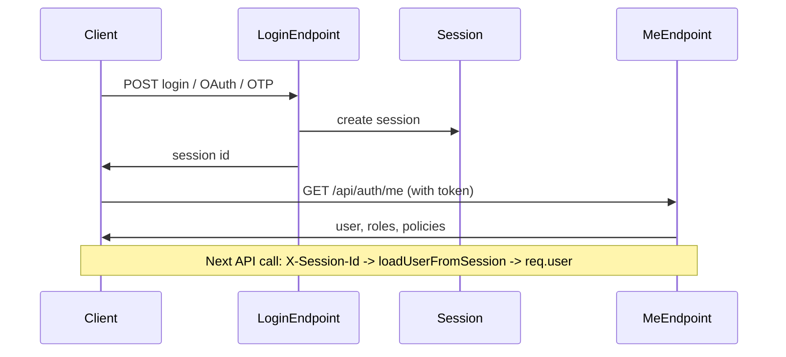

# GMS – Complete Application Architecture & Operations Guide

Single reference for GMS architecture, file roles, RBAC, authentication, and operations. Is document mein **Goyalsons Management System (GMS)** ka pura structure, har folder, aur important files ka role ek hi jagah hai — kya kya karti hain aur kaise kaam karti hain.

---

## 1. App Kya Hai (Overview)

- **GMS** = Employee, Attendance, Sales, Roles, Users, Requests, Training, Salary, Settings waghera manage karne wala internal web app.
- **Login**: Email+Password, Google OAuth, ya Employee Card + OTP.
- **Access**: Role-based (Director, HR, Manager, SalesMan, etc.) — har role ko alag pages/actions dikhte hain (RBAC).
- **Stack**: React (Vite) frontend + Node/Express backend + PostgreSQL (Prisma).

---

## 2. Verified vs Assumed

- **Verified:** File paths, route lists, and policy keys in `server/constants/policies.ts` and `client/src/config/nav.config.ts`; route registration in `server/routes/index.ts` and `client/src/App.tsx`; behavior of `requirePolicy` and Director bypass in `server/lib/auth-middleware.ts`; `getUserAuthInfo` in `server/lib/authorization.ts`; PageGuard and MainLayout filtering logic.
- **Assumed:** Exact behavior of every legacy route in `server/routes-legacy.ts` has not been individually traced. `getPolicyForPath(location)` now uses path-to-regexp so dynamic paths (e.g. `/roles/:id`) match concrete locations (e.g. `/roles/xyz`).

---

## 3. RBAC Policy Naming Convention

Two formats are used in the codebase (both valid):

1. **resource.action** – Lowercase, dots, optional hyphens/underscores (e.g. `dashboard.view`, `attendance.history.view`, `roles-assigned.view`). Used for page/nav and most feature policies. Defined by `POLICY_KEY_REGEX` in `server/constants/policies.ts`.
2. **UPPER_SNAKE_CASE** – e.g. `VIEW_USERS`, `CREATE_USER`, `EDIT_ROLE`. Used for RBAC management (users, roles, policies). Defined by `POLICY_KEY_RBAC_REGEX` in the same file.

**Documentation standard:** In this guide, policy keys are written exactly as in code. When listing policies, we indicate which format applies (page vs RBAC). No new formats are introduced.

**Why two formats:** Page policies historically used `resource.action`; RBAC management policies were added later as UPPER_SNAKE. The backend accepts both via `isValidPolicyKey` in `server/constants/policies.ts`.

---

## 4. Policy Source of Truth

- **Single source:** `shared/policies.ts` is the single source of truth for all policy keys. It exports `POLICY_REGISTRY` (key, description, category), `POLICY_KEYS_FLAT`, `POLICY_GROUPS`, and optional `POLICY_ALIASES`. Both server and client (via Vite alias `@shared`) use this registry.
- **Backend:** `server/constants/policies.ts` imports the registry and builds the `POLICIES` object for backward compatibility; `getAllPolicyKeys()` returns `POLICY_KEYS_FLAT` so `requirePolicy(policyKey)` allowlist is registry-driven.
- **Seed:** `prisma/seed.ts` uses `POLICY_REGISTRY` from shared; no duplicated policy arrays.
- **Policy sync:** `server/services/policy-sync.service.ts` syncs `POLICY_REGISTRY` to the DB on startup (creates missing policies; optionally removes disallowed in non-production).
- **Nav:** `client/src/config/nav.config.ts` defines path and policy per nav item. `getPolicyForPath(path)` uses **path-to-regexp** so dynamic routes (e.g. `/roles/:id`) match concrete paths (e.g. `/roles/123`).
- **Summary:**

| Question | Source |
|----------|--------|
| Which policy keys exist (canonical list)? | `shared/policies.ts` (POLICY_REGISTRY). |
| Which policy keys exist (runtime)? | DB, after policy-sync + seed. |
| Which policy protects which route? | `nav.config.ts` and App.tsx PageGuard; path matching via path-to-regexp. |
| Backend allowlist for requirePolicy? | `getAllPolicyKeys()` from registry (server/constants/policies.ts). |

---

## 5. Frontend vs Backend Access Control

- **Frontend:** (1) **Route:** PageGuard wraps routes; uses `policy` prop or `getPolicyForPath(location)` and `hasPolicy()`. (2) **Nav:** MainLayout filters nav items by `hasPolicy(item.policy)`. (3) **Buttons/actions:** Pages conditionally show Create/Edit/Reset etc. using `user.policies.includes("CREATE_USER")` (or similar). Frontend is UX only; not sufficient for security.
- **Backend:** Every protected API uses `requireAuth` and then `requirePolicy(policyKey)` or `requireAnyPolicy(...)`. Director bypasses. Session is loaded by `loadUserFromSession`; policies come from `getUserAuthInfo` (DB: User → UserRole → Role → RolePolicy → Policy).
- **Rule:** Backend must enforce policy; frontend only hides/shows UI.

---

## 6. Core Authentication Flows

- **Email/password:** Client POST `/api/auth/login` with email and password → server (`auth.routes.ts`) validates (hash match or env override), creates Session, returns session id → client stores token, calls `/api/auth/me` to get user, roles, and policies.
- **Google OAuth:** Client redirects to `/api/auth/google` → Google → callback `/api/auth/google/callback` → server ensures email is in ALLOWED_GOOGLE_EMAILS, finds or creates User, creates Session, redirects to `/auth-callback?token=...` → client stores token, then same as above.
- **OTP (card):** Client POST employee-lookup → send-otp → user enters OTP → POST verify-employee-otp with employeeCode and otp → server (`otp.routes.ts`) validates OTP, finds or creates User linked to Employee, returns token → client stores token.
- **Session on subsequent requests:** Client sends header `X-Session-Id` with token → `loadUserFromSession` resolves session, optionally uses auth cache, loads user and policies into `req.user`.



---

## 7. Edge Cases and Security Rules

- **Self-disable:** PATCH `/api/users/:id` with `status: "disabled"` is rejected when the target user id is the current user (`server/routes/users.routes.ts`).
- **Role with users:** DELETE role returns 400 if any user is assigned that role (`server/routes/roles.routes.ts`).
- **Director bypass:** All `requirePolicy` checks skip when the user has role name "Director".
- **No-policy users:** Users with no policies or only `no_policy.view` are redirected to `/no-policy` (PageGuard / App logic).
- **Role assignment scope:** `canAssignRole` in `server/lib/role-assignment-security.ts` restricts who can assign which role (e.g. org scope); backend uses this before assign/remove.
- **Employee inactive:** In OTP/login flows, an employee with certain inactive state (e.g. lastInterviewDate) may be blocked from login (legacy/OTP logic).
- **Policy allowlist:** Backend returns 500 INVALID_POLICY for policy keys not in the shared registry (getAllPolicyKeys()).
- **Last Director:** Changing a user’s role from Director to another role is rejected if they are the only user with the Director role (`ensureNotLastDirector` in `server/lib/role-assignment-security.ts`).
- **Role policy change:** When a role’s policies are updated (PATCH `/api/roles/:id`), `incrementPolicyVersionForRoleUsers(roleId)` is called so all users with that role get fresh policies on next request (auth cache revalidates).

---

## 8. Manual Testing Checklist

- Director can open Users, Roles, and Policies and perform create, edit, reset password, and assign role.
- HR (or a role with only VIEW_* and no CREATE_*) can open management pages but cannot create user or edit role policies if lacking `CREATE_USER` or `EDIT_ROLE`.
- User with no relevant policy gets Access Denied on the route and 403 on the API.
- Self-disable is rejected (PATCH self to disabled).
- Delete role with assigned users is rejected.
- Login with email/password, Google, and OTP each yields a session and `/api/auth/me` returns policies.
- Nav items are visible only when the user has the corresponding policy.
- Dynamic route policy: Visiting `/roles/123` resolves to policy from `/roles/:id` (path-to-regexp).
- **RBAC consistency:** Run `npm run rbac:check` to validate requirePolicy keys and nav policies against the registry.
- **System health:** GET `/api/system/health` returns policy registry count, DB policy count, roles count, missing critical policies, seed version, and auth cache size (no auth required).
- **Startup guard:** After policy sync, server logs a warning if any registry policies are missing in the DB.
- **Audit Logs:** Route `/audit-logs` (policy `audit.view`) shows read-only table of audit entries; GET `/api/audit-logs` with pagination and filters (date, actor, action, entity).
- **System Health:** Route `/system/health` (policy `system.health.view`) is Director-only; shows registry vs DB policy counts, roles count, cache size, and missing policies. GET `/api/system/health/dashboard` (protected) returns diagnostics; GET `/api/system/health` remains public for load balancers. Use for operational checks (RBAC consistency, missing policies).

---

## 9. How to Add a New Page with Policy

1. **Policy key:** Add the key to `shared/policies.ts` in `POLICY_REGISTRY` (key, description, category). The server allowlist, seed, and policy-sync all derive from this; no need to edit server/constants/policies.ts for the allowlist (POLICIES object can be extended for named constants if desired).
2. **Backend:** If the page needs a new API, add route(s) and protect with `requireAuth` and `requirePolicy("policy.key")` (or `requireAnyPolicy`).
3. **Frontend:** Add the page component under `client/src/pages/`. In App.tsx, add a Route and wrap with `<PageGuard policy="policy.key">...</PageGuard>`.
4. **Nav (optional):** Add an entry in `client/src/config/nav.config.ts` (path, label, policy). Use path patterns like `/resources/:id` for dynamic routes; path-to-regexp will match concrete paths. Add the same item in MainLayout `navItems` with the same policy.
5. **Role assignment:** Assign the policy to the appropriate roles (via seed or via Roles Assigned / Roles Management UI).
6. **Consistency:** Run `npm run rbac:check` to ensure all requirePolicy literals and nav policies are in the registry.

---

## 10. Tech Stack

| Layer    | Tech |
|----------|------|
| Frontend | React, TypeScript, Vite, Wouter (routing), TanStack Query, Tailwind, shadcn/ui |
| Backend  | Node.js, Express, TypeScript |
| DB       | PostgreSQL, Prisma ORM |
| Auth     | Session (DB), Google OAuth, password hash, OTP (SMS) |
| Deploy   | Railway (server), static build (client) |

---

## 11. Root Folder Structure (Ek Nazar Mein)

```
GoyalsonsManagementSystem/
├── client/           → React frontend (UI, pages, components)
├── server/           → Express backend (API, auth, routes)
├── prisma/           → DB schema, migrations, seed
├── scripts/          → DB restore, tests, troubleshoot
├── tests/            → Unit, API, integration, e2e tests
├── package.json      → Dependencies, npm scripts
├── vite.config.ts    → Vite + client build config
├── tsconfig.json     → TypeScript config
└── .env              → Secrets (DB, Google, SMS, etc.)
```

---

## 12. Client (Frontend) – Folder aur Files

### 12.1 Entry & App Root

| File | Kya karti hai |
|------|----------------|
| **client/index.html** | Single HTML entry; React root mount hota hai. |
| **client/src/main.tsx** | ReactDOM render, App wrap with providers (Query, Auth, Theme). |
| **client/src/App.tsx** | **Sab routes yahi define**: `/`, `/login`, `/employees`, `/attendance/*`, `/sales/*`, `/users-management`, etc. Public routes (login, apply, auth-callback) aur protected routes (MainLayout ke andar). Har route ke liye kaun sa page component load hoga (lazy) + kabhi kabhi **PageGuard** (policy check). |

### 12.2 Config

| File | Kya karti hai |
|------|----------------|
| **client/src/config/nav.config.ts** | **NAV_CONFIG** = sidebar/nav ka single source: har item ka `path`, `label`, `policy` (e.g. `dashboard.view`, `VIEW_USERS`). Policy se decide hota hai kaun sa menu item dikhe. |

### 12.3 Lib (Shared logic, API, Auth)

| File | Kya karti hai |
|------|----------------|
| **client/src/lib/api.ts** | **Saari API calls**: `apiGet`, `apiPost`, `apiPut`, `apiPatch`, `apiDelete` + `getAuthHeaders()` (token). Plus **usersApi**, **rolesApi**, **policiesApi**, **employeesApi**, **dashboardApi**, etc. — har resource ke liye functions (getList, update, create, delete). |
| **client/src/lib/auth-context.tsx** | **Auth state**: login/logout, token, current **user** (id, name, email, **roles**, **policies**). **hasPolicy(policy)** se check hota hai permission. **usePolicies()** bhi yahi se. Session expiry, SSE for “logout all” handle. |
| **client/src/lib/queryClient.ts** | TanStack Query client instance (default options). |
| **client/src/lib/theme-context.tsx** | Light/dark theme state. |
| **client/src/lib/utils.ts** | Small helpers (cn, format, etc.). |
| **client/src/lib/auth.ts** | Legacy/auth helpers agar use ho rahe hon. |
| **client/src/lib/db.ts** | Client-side DB-related helpers (e.g. IndexedDB) agar use ho. |

### 12.4 Components

| File | Kya karti hai |
|------|----------------|
| **MainLayout.tsx** | **Sidebar + top bar**: nav items **nav.config** / policy se filter hoke dikhte hain. User menu, theme toggle, logout. Children = page content. |
| **PageGuard.tsx** | **Route-level permission**: agar user ke paas required **policy** nahi to “Access Denied” dikhata hai; warna children render. |
| **AppleLoader.tsx** | Loading spinner/UI. |
| **HelpTicketForm.tsx** | Help ticket create/edit form. |
| **SalesExcelPivotTable.tsx** | Sales data pivot table UI. |
| **WorkflowBuilder.tsx** | Workflow/role workflow builder UI. |
| **client/src/components/ui/** | Reusable UI: Button, Input, Dialog, Table, Select, Card, etc. (shadcn style). |

### 12.5 Hooks

| File | Kya karti hai |
|------|----------------|
| **use-mobile.tsx** | Mobile breakpoint detect. |
| **use-pages.ts** | UI pages / nav pages related hook. |
| **use-toast.ts** | Toast notifications. |

### 12.6 Pages (Har page kya dikhata hai / kya karta hai)

| Path / File | Kya karti hai |
|-------------|----------------|
| **/login** → login.tsx | Login UI: Email+Password, Google button, Card+OTP flow. Login success pe token set, phir policy ke hisaab se redirect (e.g. `/`, `/sales`, `/no-policy`). |
| **/apply** → apply.tsx | Apply / registration type page. |
| **/auth-callback** → auth-callback.tsx | Google OAuth callback: token receive karke redirect. |
| **/** → dashboard.tsx | Main dashboard (stats, recent activity, etc.). |
| **/no-policy** → no-policy.tsx | Jab user ke paas koi useful policy nahi (sirf no_policy.view) — yahi dikhta hai. |
| **/employees** → employees/index.tsx | Members list (filters, search), assign role, create member. |
| **/employees/create** → employees/create.tsx | New member create form. |
| **/attendance** → attendance.tsx | Work log landing. |
| **/attendance/today** → attendance/today.tsx | Aaj ka work log. |
| **/attendance/fill** → attendance/fill.tsx | Work log fill form. |
| **/attendance/history** → attendance/history.tsx | Task/attendance history. |
| **/attendance/team** → attendance/team.tsx | Team attendance (manager). |
| **/sales** → sales/index.tsx | Sales list/overview. |
| **/sales/unit/:unitName** → sales/unit.tsx | Unit-wise sales. |
| **/sales-staff** → sales-staff.tsx | Sales staff view. |
| **/requests** → requests/index.tsx | Requests list. |
| **/requests/team** → requests/team.tsx | Team requests. |
| **/roles-assigned** → roles-assigned/index.tsx | **Roles Assigned**: role cards, role pe click → policies edit / members assign. “Add Configuration” = create email+password user + role. |
| **/roles** → roles/index.tsx | Roles list. |
| **/roles/:id** → roles/[id].tsx | Edit single role. |
| **/roles/manager/assign** → roles/manager/assign.tsx | Assign manager. |
| **/users-management** → users-management.tsx | **Users (RBAC)**: list users (search, pagination), Create User, Edit (name/status), Reset Password, Change Role. VIEW_USERS + CREATE_USER/EDIT_USER/etc. |
| **/roles-management** → roles-management.tsx | **Roles (RBAC)**: list roles, edit name/description, edit role policies (grouped checkboxes). VIEW_ROLES, EDIT_ROLE. |
| **/policies-management** → policies-management.tsx | **Policies (RBAC)**: list policies, create/edit (description, category). VIEW_POLICIES, CREATE_POLICY, EDIT_POLICY. |
| **/assigned-manager** → assigned-manager.tsx | Assigned manager view. |
| **/assigned-manager/team-members** → assigned-manager/team-members.tsx | Team members list. |
| **/manager/dashboard** → manager/dashboard.tsx | Manager dashboard. |
| **/manager/team-task-history** → manager/team-task-history.tsx | Manager team task history. |
| **/manager/team-sales-staff** → manager/team-sales-staff.tsx | Manager team sales staff. |
| **/training** → training.tsx | Training page. |
| **/salary** → salary.tsx | Salary view. |
| **/settings** → settings.tsx | User settings (password change, theme, etc.). |
| **/admin/routing** → admin/routing.tsx | API routing config. |
| **/admin/master-settings** → admin/master-settings.tsx | Master settings. |
| **/admin/logout-all-sessions** → admin/logout-all-sessions.tsx | Logout all users (Director). |
| **/integrations/fetched-data** → integrations/fetched-data.tsx | Fetched integrations data. |
| **/not-found** → not-found.tsx | 404 page. |

---

## 13. Server (Backend) – Folder aur Files

### 13.1 Entry & App Setup

| File | Kya karti hai |
|------|----------------|
| **server/index.ts** | **Server entry**: Express app create, body parser, routes register, static serve, policy sync start, auto-sync start, sales table create, HTTP server listen. |
| **server/app.ts** | Express app configuration (middleware, etc.) agar alag file mein ho. |
| **server/static.ts** | Frontend build ko serve karne ka logic (production). |
| **server/vite.ts** | Dev mein Vite dev server middleware (HMR). |

### 13.2 Routes (API Endpoints) – Kaun file kaun sa API handle karti hai

| File | Kya karti hai |
|------|----------------|
| **server/routes/index.ts** | **Saari route modules register**: auth, OTP, sales, roles, policies, users, user-assignment, rbac-admin, pages, help-tickets, lookup, emp-manager, manager, etc. + **loadUserFromSession** middleware. |
| **server/routes/auth.routes.ts** | **Login, session, logout**: POST `/api/auth/login`, GET `/api/auth/google`, GET `/api/auth/google/callback`, GET `/api/auth/me`, POST `/api/auth/logout`, GET `/api/auth/session-events` (SSE). |
| **server/routes/otp.routes.ts** | **OTP login**: POST `/api/auth/employee-lookup`, `/api/auth/send-employee-otp`, `/api/auth/verify-employee-otp` — card number se user resolve, OTP send/verify, token return. |
| **server/routes/users.routes.ts** | **Users (RBAC)**: GET `/api/users` (list, pagination, search), PATCH `/api/users/:id`, PATCH `/api/users/:id/password`, PATCH `/api/users/:id/role`. Policies: VIEW_USERS, EDIT_USER, RESET_PASSWORD, ASSIGN_ROLE. |
| **server/routes/user-assignment.routes.ts** | **User–role**: POST `/api/users/assign-role`, DELETE `/api/users/:userId/roles/:roleId`, POST `/api/users/create-credentials` (create/update email+password user + role). |
| **server/routes/roles.routes.ts** | **Roles CRUD**: GET/POST `/api/roles`, GET/PUT/DELETE `/api/roles/:id`. Policies: VIEW_ROLES / ROLES_ASSIGNED_VIEW, CREATE_ROLE, EDIT_ROLE. |
| **server/routes/policies.routes.ts** | **Policies**: GET `/api/policies`, POST `/api/policies`, PATCH `/api/policies/:id`. VIEW_POLICIES, CREATE_POLICY, EDIT_POLICY. |
| **server/routes/sales.routes.ts** | Sales-related APIs (e.g. sales data, units). |
| **server/routes/sales-staff.routes.ts** | Sales staff / pivot APIs. |
| **server/routes/help-tickets.routes.ts** | Help tickets CRUD/APIs. |
| **server/routes/manager.routes.ts** | Manager-specific APIs (team, etc.). |
| **server/routes/emp-manager.routes.ts** | Employee–manager assignment APIs. |
| **server/routes/lookup.routes.ts** | Lookup APIs (e.g. employee lookup). |
| **server/routes/pages.routes.ts** | UI pages / nav pages API. |
| **server/routes/admin.routes.ts** | Admin APIs. |
| **server/routes/rbac-admin.routes.ts** | RBAC admin (backfill, etc.). |
| **server/routes/settings.routes.ts** | User settings API (e.g. password change). |
| **server/routes/system-settings.routes.ts** | System settings API. |
| **server/routes/data-fetcher.routes.ts** | Data fetcher / integrations. |
| **server/routes/workflow.routes.ts** | Workflow save/load. |
| **server/routes/auth-utils.ts** | Google OAuth strategy setup, whitelist (ALLOWED_GOOGLE_EMAILS). |
| **server/routes-legacy.ts** | Purane routes jo ab bhi use ho rahe hain (incremental migrate). |

### 13.3 Auth & RBAC (Lib)

| File | Kya karti hai |
|------|----------------|
| **server/lib/auth-middleware.ts** | **requireAuth**, **requirePolicy(policyKey)**, **requireAnyPolicy(...keys)**. Session se user load (loadUserFromSession), Director bypass. Password **hashPassword** (sha256). |
| **server/lib/authorization.ts** | **getUserAuthInfo(userId)** → user + roles + **policies** (DB se role→policies resolve). Manager auto-policies (emp_manager table). Org subtree for scope. |
| **server/lib/auth-cache.ts** | SessionId → auth snapshot cache (policies, roles). Invalidate on role change / logout. |
| **server/lib/session-events.ts** | SSE “logout all” broadcast. |
| **server/constants/policies.ts** | **POLICIES** object (sab policy keys: dashboard.view, VIEW_USERS, CREATE_USER, etc.). Policy key validation (dot + UPPER_SNAKE). |
| **server/lib/role-replacement.ts** | **replaceUserRoles(userId, roleId)** — single-role: saari roles hata ke ek role assign. |
| **server/lib/role-assignment-security.ts** | **canAssignRole** — kya current user kisi user ko ye role assign kar sakta hai (org scope, etc.). |
| **server/lib/validation.ts** | validateUUID, validateRoleName, validatePolicyKey, validatePolicyIds. |
| **server/lib/prisma.ts** | Prisma client instance. |

### 13.4 Services & Other Server Files

| File | Kya karti hai |
|------|----------------|
| **server/services/policy-sync.service.ts** | Startup pe **NAV_CONFIG** (client) se policies DB mein sync. |
| **server/services/page-management.service.ts** | UI pages / page management logic. |
| **server/auto-sync.ts** | Zoho/employee sync, scheduled jobs. |
| **server/bigquery-service.ts** | BigQuery se attendance/data. |
| **server/sms-service.ts** | OTP SMS send (InstaAlerts, etc.). |
| **server/create-sales-data-table.ts** | Sales data table ensure/create. |
| **server/lib/audit-log.ts** | Audit log entries (role assign, policy change, etc.). |

---

## 14. Prisma (Database)

| File | Kya karti hai |
|------|----------------|
| **prisma/schema.prisma** | **Saari tables**: User, Role, Policy, UserRole, RolePolicy, Employee, Attendance, Session, OrgUnit, Department, Designation, HelpTicket, Task, etc. Relations bhi yahi. |
| **prisma/seed.ts** | **Seed data**: Policies create (dashboard.view, VIEW_USERS, …), Roles create (Director, HR, Manager, …), role–policy assign (Director = sab), HR = limited. Users ALLOWED_GOOGLE_EMAILS se + role assign. |
| **prisma/migrations/** | Har migration = SQL file (e.g. User.passwordHash optional). `prisma migrate deploy` se apply. |

---

## 15. Flow – Short Summary

1. **Request aate hi**: `loadUserFromSession` sessionId se user load karta hai, auth cache se policies attach karta hai → **req.user** (roles, policies).
2. **Har protected API**: `requireAuth` + `requirePolicy(key)` ya `requireAnyPolicy(...)` — Director bypass, baaki ko policy check.
3. **Frontend**: Login pe token milta hai, **/api/auth/me** se user + policies. **hasPolicy** se nav items + buttons show/hide. **PageGuard** se route level block.
4. **Nav**: **nav.config** + **MainLayout** — jo policy user ke paas hai, wahi menu items dikhte hain.

See **Core Authentication Flows** (Section 6) and **Frontend vs Backend Access Control** (Section 5) for details.

---

## 16. Important Commands

```bash
npm run dev          # Backend + dev server
npm run dev:client   # Sirf frontend (Vite)
npm run seed         # DB seed (roles, policies, users)
npx prisma generate  # Prisma client
npx prisma migrate deploy  # Migrations apply
```

---

## 17. Ek Line Mein Har Important File

| File | Ek line |
|------|--------|
| **App.tsx** | Saari routes + PageGuard; login/public vs protected. |
| **nav.config.ts** | Sidebar/nav items + policy per path. |
| **api.ts** | Saari API calls + resource APIs (users, roles, policies, employees, …). |
| **auth-context.tsx** | Login state, user, policies, hasPolicy, usePolicies. |
| **MainLayout.tsx** | Sidebar + nav (policy se filter) + layout. |
| **PageGuard.tsx** | Route pe policy check; na ho to Access Denied. |
| **login.tsx** | Login UI (email/password, Google, OTP). |
| **users-management.tsx** | Users list, create, edit, reset password, change role. |
| **roles-management.tsx** | Roles list, edit role, edit role policies. |
| **policies-management.tsx** | Policies list, create, edit. |
| **roles-assigned/index.tsx** | Roles + members assign + Add Configuration (create user). |
| **server/index.ts** | Server start, routes, static, sync. |
| **server/routes/index.ts** | Saari route modules register. |
| **server/routes/auth.routes.ts** | Login, Google, /me, logout, session-events. |
| **server/routes/users.routes.ts** | GET/PATCH users, password, role. |
| **server/routes/roles.routes.ts** | Roles CRUD. |
| **server/routes/policies.routes.ts** | Policies CRUD. |
| **server/routes/user-assignment.routes.ts** | assign-role, remove-role, create-credentials. |
| **server/lib/auth-middleware.ts** | requireAuth, requirePolicy, loadUserFromSession, hashPassword. |
| **server/lib/authorization.ts** | getUserAuthInfo (user + roles + policies). |
| **server/constants/policies.ts** | Policy keys constant + validation. |
| **prisma/schema.prisma** | DB tables. |
| **prisma/seed.ts** | Default roles, policies, users. |

Isi ek file (**APP_COMPLETE_GUIDE.md**) se tum pura app ek jagah samajh sakte ho: kaun folder kya hai, kaun file kya karti hai, aur flow kaise chalta hai.

---

## Summary of Improvements

- Document title renamed to **GMS – Complete Application Architecture & Operations Guide** with a one-line subtitle.
- Added sections: **Verified vs Assumed**, **RBAC Policy Naming Convention**, **Policy Source of Truth**, **Frontend vs Backend Access Control**, **Core Authentication Flows**, **Edge Cases and Security Rules**, **Manual Testing Checklist**, **How to Add a New Page with Policy**.
- Policy key format standardized in documentation (exact code strings; both `resource.action` and UPPER_SNAKE documented and when each applies).
- Existing content preserved and renumbered (sections 2–9 became 10–17). Flow section (Section 15) cross-references Core Authentication Flows and Frontend vs Backend Access Control.
- No business logic or runtime code changed.

---

## Modified Files

- **APP_COMPLETE_GUIDE.md** (this file only).

---

## Assumptions

- The reader has access to the repository; file paths in this guide are sufficient.
- The “RBAC architecture guide” is satisfied by the new sections within this document rather than a separate file.
- `getPolicyForPath(location)` may not match dynamic routes like `/roles/:id` when location is `/roles/xyz` (exact match in nav.config); this is noted under Verified vs Assumed.

---

## Inconsistencies Found

- **Policy source:** Two sources feed the DB: policy-sync (from server copy of NAV_CONFIG) and seed (RBAC and others). Both create policies; neither deletes. Documented in **Policy Source of Truth** (Section 4).
- **Backend allowlist:** `requirePolicy` only allows keys in the POLICIES constant; any new policy used on the backend must be added to `server/constants/policies.ts` (and optionally to seed/nav).
- **Nav path matching:** `getPolicyForPath` uses exact path match; dynamic routes in NAV_CONFIG (e.g. `/roles/:id`) may not match the actual location. If the app uses path-pattern matching elsewhere, that should be verified and noted.

---

## Architecture Health-Check Note

The architecture is consistent with: two policy key formats in use (`resource.action` and UPPER_SNAKE); two feeds into the DB (policy-sync and seed); backend allowlist in `server/constants/policies.ts`; frontend and backend both enforce access (PageGuard/MainLayout and requirePolicy/requireAnyPolicy); Director bypass and the documented edge cases (self-disable, role with users, no-policy redirect, role assignment scope) are implemented in code.
